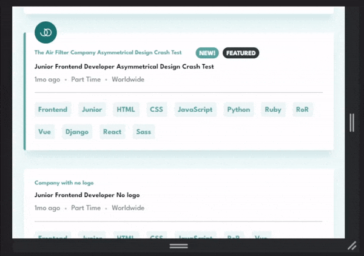

Live site: https://jeanwll.github.io/static-job-listings-master/


# Frontend Mentor - Job listings with filtering solution

This is a solution to the [Job listings with filtering challenge on Frontend Mentor](https://www.frontendmentor.io/challenges/job-listings-with-filtering-ivstIPCt). Frontend Mentor challenges help you improve your coding skills by building realistic projects.

## Table of contents

- [The challenge](#the-challenge)
- [Built with](#built-with)
- [Methodology](#methodology)
- [What I learned](#what-i-learned)
  - [Accessibility and ARIA](#accessibility-and-aria)
  - [Semantic CSS](#semantic-css)
  - [Asymmetric design](#asymmetric-design)
- [Continued development](#continued-development)
  - [Unclear visual cue](#unclear-visual-cue)
  - [HTML Semantic considerations](#html-semantic-consideration)
- [Author](#author)

## The challenge

Users should be able to:

- View the optimal layout for the site depending on their device's screen size
- See hover states for all interactive elements on the page
- Filter job listings based on the keywords
- [Added] Reload jobs if any error is raised during data fetching [Error demo](https://jeanwll.github.io/static-job-listings-master/?error)
- [Added] Save filters in localStorage

## Built with

- Semantic HTML5 markup
- CSS custom properties
- Flexbox
- Object Oriented JavaScript
- [ArrowJS](https://www.arrow-js.com/) - Reactive UI with native JavaScript

## Methodology

- JS Class as UI compononents (Filters, Jobs)

```js
const filters = new Filters()
const jobs = new Jobs(filters)

html`

${filters.render()}
${jobs.render()}

`(document.body)
```

- Divided component parts rendering into different `render*()` class methods

```js
class Jobs {
  ...

  render() {}
  renderJobs() {}
  renderDescription(job) {}
  renderKeywords(job) {}
}

class Filters {
    ...
    
    renderFilters() {
        return this.data.filters.map(filter => {
            return html`
    
            <li class="filter">
                <span>${filter}</span>
                <button class="filter__btn" aria-controls="jobs"
                    @click="${() => this.toggle(filter)}">
                    
                    <span class="visually-hidden">Remove filter</span>
                </button>
            </li>
    
            `
        })
    }
}
```

## What I learned

### Accessibility and ARIA

- `visually-hidden` CSS class is more reliable than `aria-label`.

`aria-label` should be well supported for buttons, but I used `visually-hidden` over `aria-label` for consistency.
[When to use aria-label or screen reader only text](https://bootcamp.uxdesign.cc/when-to-use-aria-label-or-screen-reader-only-text-cd778627b43b)

- `aria-live` on the jobs list section to suggest *dynamic content*.

- `aria-controls="jobs"` on filtering and keywords toggle buttons to *specify elements association*.

- `aria-busy` on the job list to convey *pending data fetching*.

- `aria-pressed` on keywords *toggle buttons*

### Semantic CSS

Using previously mentionned aria attributes and properties is a great way to write meaningful CSS rulesets.

```css
#jobs[aria-busy] .jobs__error,
.jobs:not(:empty) + .jobs__error {
    display: none;
}
```

```css
.keyword__btn[aria-pressed=true] {}
.keyword__btn[aria-pressed=false] {}
```

### Asymmetric design

[**Truncation is not a content strategy**](https://css-tricks.com/embracing-asymmetrical-design/)

My first approach for the layout to adapt to user-generated content (Company name, Job title, keywords list) was to use `text-overflow: ellipsis` paired with `title` attribute.

Furthering my research on accessibility, I realized `title` wouldn't be helpful on touch-based devices.

This is when I came across the above article and decided to *embrace asymmetric design*.

Here is an example using unusual flexbox combinations:
```css
.job__top {
    display: flex;
    flex-direction: row-reverse;
    flex-wrap: wrap;
    justify-content: flex-end;
    align-items: center;
    row-gap: 10px;
}
```
Notice 'new' and 'preview' tags wrapping on top instead of below:




## Continued development

### Unclear visual cue

The design currently doesn't convey a very clear *call to action* aka where to click if you want more info about the job.

### HTML Semantic considerations 

I am unsure about the html semantic used to describe the job.

Something that came to my mind was the definition list `<dl>`.

However after further researches I figured "Position, Company, ..." are not really *terms*.

Using simple unordered list `<ul>` would make the layout very difficult to achieve, especially while implementing *asymmetric design*, since you can't have generic `<div>` between `<ul>` and `<li>`.

I decided to simply use a succession of paragraphs `<p>`.

## Author

- Website - [Jean Will](https://jeanwill.me)
- Frontend Mentor - [@jeanwll](https://www.frontendmentor.io/profile/jeanwll)